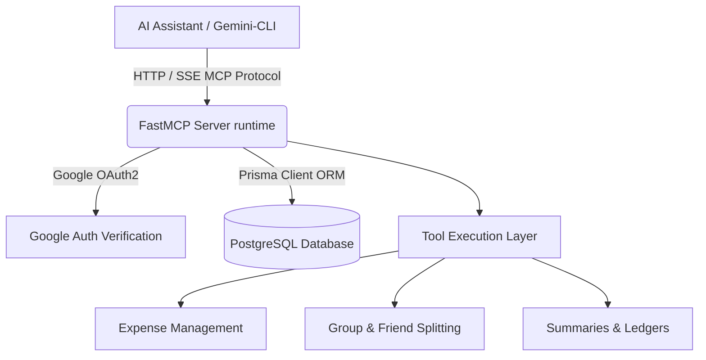
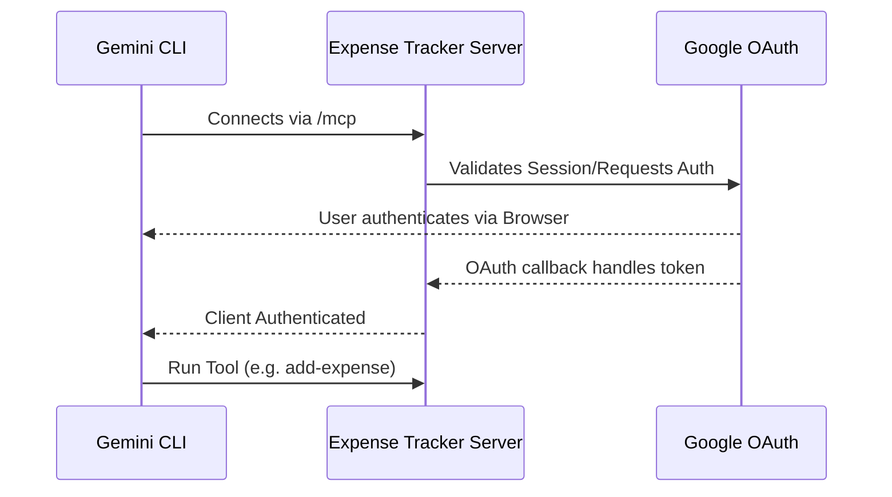

# Expense Tracker MCP Server

A powerful multi-user Model Context Protocol (MCP) server for tracking personal expenses and splitting bills with friends. Built with [FastMCP](https://github.com/joshua-berry/fastmcp), [Prisma](https://www.prisma.io/), and PostgreSQL.

**Note:** This application is deployed on Render with the internal domain `expense-tracker-mcp-server.railway.internal`.

This server exposes tools over HTTP/SSE allowing AI assistants (like the `gemini-cli`) to manage your expenses securely through a conversational interface, providing capabilities for adding, listing, updating, summarizing financial data, as well as managing friends, groups, and split histories.

## 🚀 Features

- **Multi-User & Authentication**: Integrated Google OAuth and session management limits operations precisely to the authenticated user.
- **Add Expenses**: Easily record new transactions with categories and descriptions.
- **Split Bills**: Seamlessly handle split expenses between friends!
- **Groups**: Create groups and add members for shared expenditures.
- **List & Filter**: View your expenses within custom date ranges and filter by category.
- **Financial Summaries**: Get categorized breakdowns of your spending over time.
- **Settle Debts**: Check split history and settle up outstanding balances.
- **Prisma Powered**: Robust database structure with PostgreSQL.

---

## 🏗️ Architecture



---

## 🛠️ Prerequisites

- **Node.js**: v18 or later.
- **pnpm**: Recommended package manager.
- **PostgreSQL Database**: A local or cloud PostgreSQL instance (e.g., Neon).
- **Google Cloud Console**: Set up an OAuth 2.0 Client ID for authentication.

## 📦 Installation & Setup

1.  **Clone the repository:**

    ```bash
    git clone https://github.com/Venu005/expense-tracker-mcp-server.git
    cd expense-tracker-mcp-server
    ```

2.  **Install dependencies:**

    ```bash
    pnpm install
    ```

3.  **Environment Setup:**
    Create a `.env` file in the root directory and add your configurations:

    ```env
    # Database URL
    DATABASE_URL="postgresql://<user>:<password>@<host>/<database>?sslmode=require"

    # Google OAuth 
    GOOGLE_CLIENT_ID="your-client-id"
    GOOGLE_CLIENT_SECRET="your-client-secret"
    BASE_URL="http://localhost:8000" # URL where the MCP server runs
    PORT=8000
    ```

    > [!IMPORTANT]
    > Ensure that `{BASE_URL}/auth/callback` (e.g., `http://localhost:8000/auth/callback`) is added to the Authorized Redirect URIs in your Google Cloud Console OAuth configuration.

4.  **Initialize Database:**
    Push the schema to your PostgreSQL database and generate the Prisma client:
    ```bash
    pnpm db:push
    ```

5.  **Start the Server:**
    Run the server in development mode:
    ```bash
    pnpm dev
    ```

---

## 🔌 Integration with `gemini-cli`

This server is designed to work seamlessly with MCP clients over `HTTP/SSE`. To integrate it tightly with the `gemini-cli`, follow these configuration steps:

1. Locate your `gemini-cli` settings file. This is normally found at `~/.gemini/settings.json`.
2. Open it in a text editor.
3. Add the `mcpServers` configuration block to configure the application to connect to the deployed instance and enable OAuth.

```json
{
  "mcpServers": {
    "expense-tracker": {
      "httpUrl": "https://expense-tracker-mcp-server-production.up.railway.app/mcp",
      "oauth": {
        "enabled": true
      }
    }
  }
}
```

### Authorization Flow



---

## 🧰 Available Tools

This MCP server provides a wide toolkit for advanced personal and group finance tracking.

### 👤 Profile & Authentication
- **`get-my-profile`**: Check your current authentication profile and ensure your user record is initialized.

### 💰 Expense Management
- **`add-expense`**: Add a new expense. Can optionally be split with friends or assigned to a group.
- **`list-expenses`**: List your logged expenses (scoped uniquely to your user).
- **`update-expense`**: Modify an existing expense's details (restricted to the payer who created it).
- **`delete-expense`**: Removes an expense from the system.
- **`get-expenses-summary-by-category`**: Aggregates and returns a spending summary grouped by category over an optional date range.
- **`get-expenses-by-category`**: Returns a list of expenses strictly matching a chosen category.

### 👥 Friends & Groups
- **`add-friend`**: Invite or link a friend to your profile by their email address.
- **`list-friends`**: Returns a list of your current friends and their mutual statuses.
- **`create-group`**: Generates a centralized group for logging shared purchases.
- **`add-group-member`**: Includes extra associates into your previously created group.
- **`list-groups`**: See all the groups that you are a member of.

### 💸 Splitting & Settlements
- **`get-split-history`**: Pulls ledger entries for shared expenses showing balances owed to or by you.
- **`settle-split`**: Records a payment against an outstanding split with a friend, effectively settling the debt.

---

## 🛠️ Development Commands

- `pnpm dev`: Boots the development server with Hot- Module Reloading.
- `pnpm build`: Compiles down the TypeScript to distribution-ready Javascript.
- `pnpm db:studio`: Opens a visualization dashboard on port 5555 to manually view and interact with database rows.
- `pnpm db:push`: Synchronizes subsequent Prisma schema changes to the underlying database without applying complex migrations.
